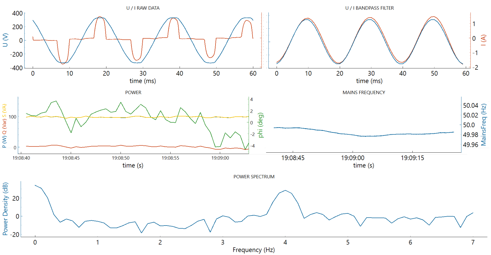

Project GSI/FAIR - Energymanagement
==============================

Project Description
-------------------
There are two main objectives of this project:  
The first objective is to develop the necessary software to visualize in real time voltage, current, frequency, phase shift, apparent-, active- and reactive power of an electric circuit with dynamic and varying appliances by only measuring voltage and current directly at the power source of the circuit.   
The second object is to disaggregate the total power consumption (active power) into the power used by each appliance in real time by utilizing only the quantities derived in the first objective.  

### Setup
The setup consists of a multi-outlet power strip with switches for each outlet. 
A measuring adapter with the the possibility to connect a clamp-on ammeter is used to connect a digitizer in order to measure voltage and current. 
The digitizer has an USB-interface which is connected to a computer. 
The software developed for deriving frequency, phase shift, apparent-, active- and reactive power can handle arbitrary appliances being connected to the monitored circuit. 
The model used for the power disaggregation can only handle 'known' appliances with an almost static power profile. 
Additionally, the model must be trained with respective training data for each appliance. 
Thus, for the power disaggregation objective, three different appliances, a halogen lamp, a fluorescent lamp a an LED has been used for training and testing. 

### GNU-Radio Module
The processing of the raw data and the calculation of frequency, phase shift, apparent-, active- and reactive power is handled by a GNU-Radio module, which has been developed for this purpose.
A ZMQ-interface, which is implemented in GNU-Radio, is used to stream live data (either to a dashboard for visualization or to an algorithm for the power disaggregation).

### Dashboard for live data
One receiver of the data transmitted by GNU-Radio over the ZMQ-interface is a PyQt-Dashbaord for the purpose of visualizing the received data. 

### Real time power disaggregation and visualization
The other receiver is a Python-package which has been developed to disaggregate the total power consumption into the power consumed per appliance in real time. 
The results of this algorithm is also visualized by a dashboard.  
The approach being used for the power disaggregration is a knowledge driven engineered model. 
During the development of the model, switching events and power consumption for each of the appliances have been analyzed. 
The knowledge gained from this analysis is then used to automatically detect switching events in the live data and, with the subsequent change in the monitored quantities (phase shift, apparent-, active- and reactive power) it could be determined which appliance has been turned on or off. 
The power profile for each appliance is modeled with affine function, which are also fitted during the 'training'.  
An example of this models performance can be seen here: 

